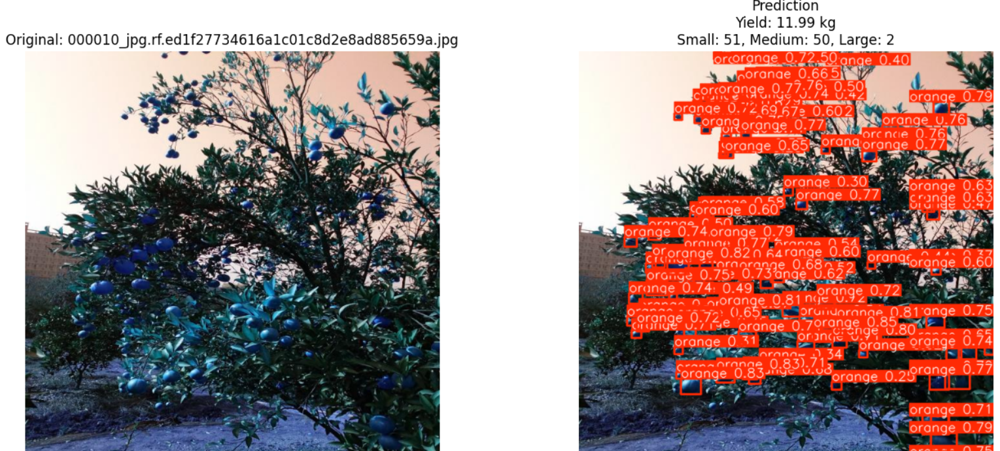

# Preharvest Tree Yield Estimation

**End of Study Project | Computer Vision & Deep Learning**

## 📋 Project Overview

This project implements multiple deep learning and machine learning approaches to estimate olive and orange tree yield before harvest using image data. The system compares regression-based models with object detection techniques to predict agricultural yield from olive and orange tree images.

**Project Duration:** March 2025 – June 2025  
**Technologies:** Python, PyTorch,matplotlib,cleanvision, scikit-learn, Transformers, YOLOv11  
**Platform:** Google Colab Pro  
**Data Annotation:** Roboflow



---

## 🎯 Key Features

- ✅ **Multi-Approach Comparison**: Explores 2 main strategies for yield prediction
- ✅ **Deep Learning Models**: ResNet18 CNN, Vision Transformers (ViT)
- ✅ **Traditional ML**: Random Forest with GLCM features
- ✅ **Object Detection**: YOLOv11 for fruit detection
- ✅ **Semantic Segmentation**: CNN-based segmentation with COCO format
- ✅ **Automated Feature Extraction**: GLCM features from masked regions
- ✅ **Data Pipeline**: From collection → annotation →augmentation->cleaning-> training → evaluation

---

## 📁 Project Structure

```
Models-Code
├── CNNmodel.ipynb                       # ResNet18 CNN regression
├── VITsegmentation.ipynb               # Vision Transformer regression
├── YoloModel.ipynb                     # YOLOv11 object detection
├── RandomForestModel.ipynb             # Random Forest with GLCM features
├── CnnSegmentation.ipynb               # Semantic segmentation (COCO format)
├── RandomForestModelSegmentation.ipynb # RF on segmented images
```

### Google Drive Directory Structure

```
MyDrive/
├── oliveTreeDataset/
│   ├── train/
│   ├── valid/
│   └── test/
├── oliveTreeRealdata/                  # CSV files with image paths and yields
│   ├── train_realdata.csv
│   ├── valid_realdata.csv
│   └── test_realdata.csv
├── YOLO_OrangeTreeFinal/
│   ├── Dataset/
│   │   ├── train/
│   │   ├── valid/
│   │   └── test/
│   ├── Weights/                        # YOLO model checkpoints
│   └── Results/                        # YOLO predictions
├── OliveTreeFinalCNNsegmentation/
│   ├── DatasetOlive/
│   │   └── _annotations.coco.json      # COCO format annotations
│   ├── MaskedImages/                   # Processed segmentation masks
│   └── ModelWeights/
└── TradionalOlives/
    ├── oliveTreeRealdata/              # CSV files
    ├── RandomForestoliveTreeFeaturesWithoutSegmentation/
    └── oliveTreeFeatures/              # Extracted GLCM features
```

---

## 🏗️ Model Architectures

### 1. **CNN Model (ResNet18)**
**File:** `CNNmodel.ipynb`

- **Architecture**: ResNet18 (pretrained on ImageNet)
- **Task**: Regression (continuous yield prediction in kg)
- **Input**: 224×224 RGB images
- **Output**: Single continuous value (yield in kg)
- **Key Features**:
  - Yield extraction from filenames using regex
  - Custom `OliveYieldDataset` class
  - Data augmentation and normalization
  - Training with MSE loss

**Workflow:**
1. Extract yields from image filenames
2. Create CSV files with image paths and yield values
3. Load and preprocess images (224×224, ImageNet normalization)
4. Train ResNet18 on regression task
5. Evaluate with MSE, MAE, R² metrics

---

### 2. **Vision Transformer (ViT)**
**File:** `VITsegmentation.ipynb`

- **Architecture**: ViT Base (vit-base-patch16-224-in21k)
- **Task**: Regression (yield estimation)
- **Input**: 224×224 RGB images
- **Custom Head**: Linear → ReLU → Dropout → Linear
- **Key Features**:
  - Pretrained Vision Transformer from Hugging Face
  - Fine-tuned for yield regression
  - Identical data pipeline as CNN

**Workflow:**
1. Load pretrained ViT model
2. Replace classification head with custom regression layers
3. Use AdamW optimizer with 5e-5 learning rate
4. Train with MSE loss
5. Compare performance with CNN baseline

---

### 3. **Random Forest with GLCM Features**
**File:** `RandomForestModel.ipynb`

- **Task**: Regression using hand-crafted features
- **Features**: GLCM (Gray Level Co-occurrence Matrix)
  - Contrast
  - Dissimilarity
  - Homogeneity
  - Energy
  - Correlation
- **Classifier**: scikit-learn RandomForest
- **Key Features**:
  - Simpler baseline for comparison
  - No deep learning required
  - Interpretable feature extraction

**Workflow:**
1. Load tree images
2. Convert to grayscale and resize (224×224)
3. Extract GLCM features from each image
4. Train RandomForest regressor
5. Evaluate with MSE, MAE, R²

---

### 4. **YOLOv11 Object Detection**
**File:** `YoloModel.ipynb`

- **Architecture**: YOLOv11 (from ultralytics)
- **Task**: Object detection (tree and fruit detection)
- **Dataset Format**: YOLO (images + .txt label files)
- **Data Source**: Roboflow (custom annotations)
- **Key Features**:
  - Real-time detection pipeline
  - Custom yield formula integration
  - High-resolution annotation support

**Workflow:**
1. Download dataset from Roboflow using API key
2. Verify data integrity (image/label count matching)
3. Train YOLOv11 on custom dataset
4. Save model weights and results
5. Apply custom yield formula based on detections

---

### 5. **CNN Semantic Segmentation**
**File:** `CnnSegmentation.ipynb`

- **Task**: Semantic segmentation with COCO format
- **Annotation Format**: COCO JSON with RLE-encoded masks
- **Processing**:
  - Decode RLE masks to binary format
  - Apply masks to original images
  - Accumulate masks for multi-instance objects
- **Output**: Masked images for downstream tasks

**Workflow:**
1. Load COCO annotations
2. Iterate through images
3. Decode RLE masks for each annotation
4. Apply bitwise AND operation to create masked images
5. Save masked images with preserved metadata

---

### 6. **Random Forest on Segmented Images**
**File:** `RandomForestModelSegmentation.ipynb`

- **Task**: Regression on segmented images
- **Input**: Masked olive tree images
- **Features**: GLCM extracted from masked regions only
- **Advantage**: Focuses on tree region, ignores background

**Workflow:**
1. Load segmented/masked images
2. Extract GLCM features from masked regions
3. Create feature vectors with corresponding yield labels
4. Train RandomForest regressor
5. Compare with non-segmented approach

---

## 🔧 Installation & Setup

### Prerequisites
- Google Colab Pro (for GPU and storage)
- Python 3.8+
- NVIDIA GPU (recommended for training)

### Required Libraries

```bash
pip install torch torchvision torchaudio
pip install transformers  # For ViT models
pip install scikit-learn  # For Random Forest and metrics
pip install ultralytics   # For YOLOv11
pip install roboflow      # For dataset downloads
pip install pycocotools   # For COCO format handling
pip install cleanvision   # For data quality checks
pip install scikit-image  # For GLCM features
pip install opencv-python # For image processing
pip install pandas matplotlib tqdm

```
## 📊 Comparison of Approaches

| Aspect | CNN (ResNet18) | Vision Transformer | Random Forest | YOLOv11 |
|--------|---------|-----------|------------|---------|
| **Type** | Deep Learning | Deep Learning | Traditional ML | Object Detection |
| **Training Time** | Medium | Medium-High | Low | High |
| **Feature Engineering** | Automatic | Automatic | Manual (GLCM) | N/A |
| **Interpretability** | Low | Low | High | Medium |
| **Data Requirements** | High | High | Low-Medium | High |
| **Accuracy Potential** | High | Very High | Medium | Good (for counting) |

---

## ⚙️ Hyperparameters

### CNN & ViT Training
```
Batch Size: 16
Optimizer: AdamW (CNN) / AdamW (ViT)
Learning Rate: 1e-4 (CNN) / 5e-5 (ViT)
Loss Function: MSELoss
Epochs: Variable (depends on convergence)
```

### Random Forest
```
n_estimators: 100
max_depth: 10-20
min_samples_split: 2
min_samples_leaf: 1
```

### YOLOv11
```
Model Size: nano (n), small (s), medium (m)
Epochs: 100
Image Size: 640
Batch Size: 16
```

## 📚 References

- **ResNet**: He et al., "Deep Residual Learning for Image Recognition" (2015)
- **Vision Transformer**: Dosovitskiy et al., "An Image is Worth 16x16 Words" (2020)
- **YOLOv11**: Ultralytics Documentation
- **GLCM Features**: Haralick et al., "Textural Features for Image Classification" (1973)
- **COCO Dataset**: Lin et al., "Microsoft COCO: Common Objects in Context" (2014)


**Last Updated:** January 2026
